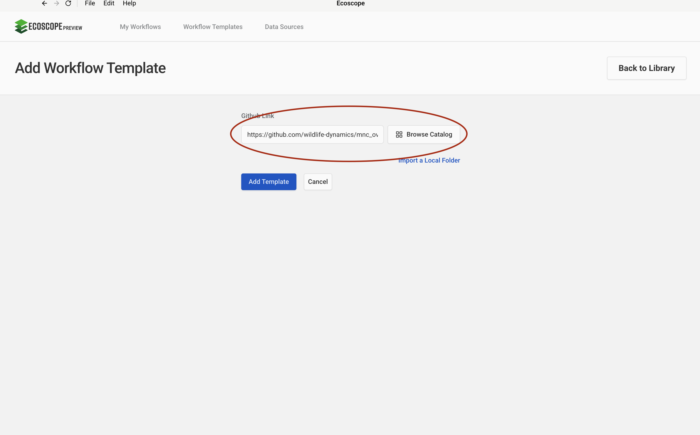
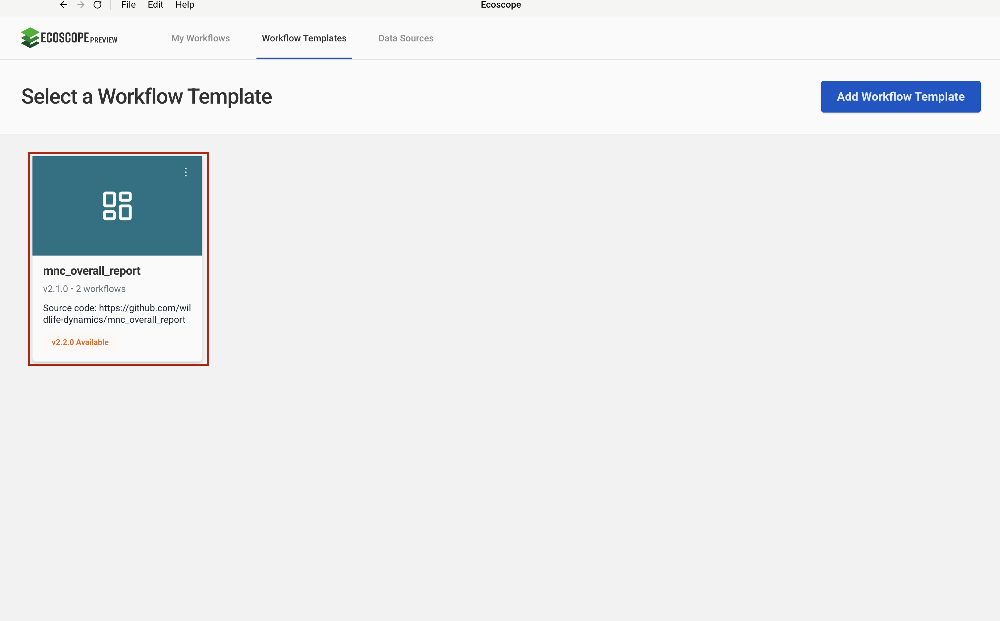

# MNC Overall Report — User Guide

This guide walks you through configuring and running the MNC Overall Report workflow, which consolidates weather observations, logistics events, wildlife sightings, and patrol data from EarthRanger into a single comprehensive monthly report.

---

## Overview

The workflow delivers, for each run:

- **7 weather charts** (HTML + PNG) — daily precipitation, temperature, wind speed, wind gusts, soil temperature, relative humidity, and atmospheric pressure per station
- **Logistics tables** — balloon landing summary, airstrip operations (pivoted by arrival/departure), airstrip maintenance log, and airline complaints
- **Wildlife reports** — sighting maps, herd-size bar charts, and individual summary tables for elephant, buffalo, rhino, lion, leopard, cheetah, giraffe, and hartebeest
- **Livestock reports** — predation event map, predation summary, cattle count table, boma movement map and summary, illegal grazing map
- **Patrol reports** — foot, vehicle, and motorbike trajectory maps with effort summaries, overall patrol coverage map
- **1 Word report** (`overall_report.docx`) — all outputs assembled into a single document

---

## Prerequisites

Before running the workflow, ensure you have:

- Access to an **EarthRanger** instance with weather station observations, logistics events, wildlife sightings, livestock events, and patrol data recorded for the analysis period

---

## Step-by-Step Configuration

### Step 1 — Add the Workflow Template

In the workflow runner, go to **Workflow Templates** and click **Add Workflow Template**. Paste the GitHub repository URL into the **Github Link** field:

```
https://github.com/wildlife-dynamics/mnc_overall_report.git
```

Then click **Add Template**.



---

### Step 2 — Configure the EarthRanger Connection

Navigate to **Data Sources** and click **Connect**, then select **EarthRanger**. Fill in the connection form:

| Field | Description |
|-------|-------------|
| Data Source Name | A label to identify this connection (e.g. `Mara North Conservancy`) |
| EarthRanger URL | Your instance URL (e.g. `your-site.pamdas.org`) |
| EarthRanger Username | Your EarthRanger username |
| EarthRanger Password | Your EarthRanger password |

> Credentials are not validated at setup time. Any authentication errors will appear when the workflow runs.

Click **Connect** to save.


---

### Step 3 — Select the Workflow

After the template is added, it appears in the **Workflow Templates** list as **mnc_overall_report**. Click the card to open the workflow configuration form.

> If a newer version is available (shown as **v2.2.0 Available** on the card), you can update the template before proceeding to pick up the latest changes.



---

### Step 4 — Configure Workflow Details, Time Range, and EarthRanger Connection

The configuration form has three sections on a single page.

**Set workflow details**

| Field | Description |
|-------|-------------|
| Workflow Name | A short name to identify this run |
| Workflow Description | Optional notes (e.g. reporting month or site) |

**Time range**

| Field | Description |
|-------|-------------|
| Timezone | Select the local timezone (e.g. `Africa/Nairobi UTC+03:00`) |
| Since | Start date and time — all data from this point is fetched |
| Until | End date and time of the analysis window |

**Connect to ER**

Select the EarthRanger data source configured in Step 2 from the **Data Source** dropdown (e.g. `Mara North Conservancy`).

Once all three sections are filled, click **Submit**.


---

## Running the Workflow

Once submitted, the runner will:

1. Fetch weather station observations from the **ER2ER - From GMMF** subject group; extract seven meteorological variables; compute daily aggregates; generate weather charts.
2. Fetch all logistics events (balloon landings, airstrip operations, airstrip maintenance, airline complaints); clean and summarise each into a CSV table.
3. Fetch boma movement, cattle count, livestock predation, and illegal grazing events; generate maps and summary tables.
4. Fetch wildlife sighting events for elephant, buffalo, rhino, lion, leopard, cheetah, giraffe, and hartebeest; generate sighting maps, herd-size bar charts, and individual summary tables.
5. Fetch wildlife incident events; generate incident maps and summary tables.
6. Fetch foot, vehicle, and motorbike patrol observations; convert to trajectories; generate patrol maps, effort summaries, and overall coverage map.
7. Assemble all outputs into **overall_report.docx**.
8. Save all outputs to the directory specified by `ECOSCOPE_WORKFLOWS_RESULTS`.

---

## Output Files

All outputs are written to `$ECOSCOPE_WORKFLOWS_RESULTS/`.

### Weather
| File | Description |
|------|-------------|
| `weather_summary_table.csv` | Daily per-station summary of all 7 weather variables |
| `precipitation_readings_over_time.html` / `.png` | Daily total precipitation |
| `temperature_readings_over_time.html` / `.png` | Daily mean surface air temperature |
| `wind_speed_readings_over_time.html` / `.png` | Daily mean wind speed |
| `wind_gusts_readings_over_time.html` / `.png` | Daily maximum wind gusts |
| `soil_temperature_readings_over_time.html` / `.png` | Daily mean soil temperature |
| `relative_humidity_readings_over_time.html` / `.png` | Daily mean relative humidity |
| `atmospheric_pressure_readings_over_time.html` / `.png` | Daily mean atmospheric pressure |

### Logistics
| File | Description |
|------|-------------|
| `balloon_landing_summary_table.csv` | Passenger records by balloon company and lodge |
| `airstrip_operations_summary_table.csv` | Client counts pivoted by camp/lodge and arrival/departure |
| `airstrip_maintenance_summary_table.csv` | Dated log of airstrip maintenance activities |

### Livestock and Boma
| File | Description |
|------|-------------|
| `mobile_boma_movement_summary_table.csv` | Boma movement summary |
| `boma_movement_map.html` / `.png` | Boma movement locations map |
| `total_cattle_count_summary_table.csv` | Cattle count summary |
| `total_livestock_predation_summary_table.csv` | Livestock predation summary |
| `livestock_predation_events.html` / `.png` | Livestock predation events map |
| `livestock_predation_summary_table.csv` | Livestock predation detail table |
| `illegal_grazing_map.html` / `.png` | Illegal grazing locations map |

### Wildlife
| File | Description |
|------|-------------|
| `total_elephants_events_recorded.csv` | Elephant sighting event count |
| `elephant_sightings_events.html` / `.png` | Elephant sightings map |
| `elephant_herd_size_bar_chart.html` / `.png` | Elephant herd size distribution |
| `elephant_herd_types_map.html` / `.png` | Elephant herd types map |
| `total_buffalo_events_recorded.csv` | Buffalo sighting event count |
| `buffalo_sightings_events.html` / `.png` | Buffalo sightings map |
| `buffalo_herd_size_bar_chart.html` / `.png` | Buffalo herd size distribution |
| `buffalo_herd_types_map.html` / `.png` | Buffalo herd types map |
| `total_rhino_events_recorded.csv` | Rhino sighting event count |
| `rhino_sightings_events.html` / `.png` | Rhino sightings map |
| `total_lion_events_recorded.csv` | Lion sighting event count |
| `individual_lions_summary.csv` | Individual lion records |
| `lion_sightings_events.html` / `.png` | Lion sightings map |
| `total_leopard_events_recorded.csv` | Leopard sighting event count |
| `individual_leopard_summary.csv` | Individual leopard records |
| `leopard_sightings_events.html` / `.png` | Leopard sightings map |
| `total_cheetah_events_recorded.csv` | Cheetah sighting event count |
| `individual_cheetah_summary.csv` | Individual cheetah records |
| `cheetah_sightings_events.html` / `.png` | Cheetah sightings map |
| `giraffe_sightings_events.html` / `.png` | Giraffe sightings map |
| `hartebeest_sightings_events.html` / `.png` | Hartebeest sightings map |

### Wildlife Incidents
| File | Description |
|------|-------------|
| `wildlife_events_recorded.csv` | Wildlife incident event count |
| `wildlife_incidents_summary_table.csv` | Wildlife incidents summary |
| `wildlife_incidents_recorded_by_date.csv` | Wildlife incidents by date |
| `wildlife_incidents_map.html` / `.png` | Wildlife incidents map |

### Events Overview
| File | Description |
|------|-------------|
| `total_events_recorded_by_date.csv` | All events recorded by date |
| `total_events_recorded_by_type.csv` | All events recorded by type |
| `total_events_recorded.html` / `.png` | All events chart |

### Patrols
| File | Description |
|------|-------------|
| `patrol_purpose_summary.csv` | Patrol purpose breakdown |
| `foot_patrol_efforts.csv` | Foot patrol effort summary |
| `foot_patrol_trajectories.geoparquet` | Foot patrol trajectory data |
| `foot_patrols_map.html` / `.png` | Foot patrol trajectories map |
| `vehicle_patrol_efforts.csv` | Vehicle patrol effort summary |
| `vehicle_patrol_trajectories.geoparquet` | Vehicle patrol trajectory data |
| `vehicle_patrols_map.html` / `.png` | Vehicle patrol trajectories map |
| `motorbike_patrol_efforts.csv` | Motorbike patrol effort summary |
| `motor_patrol_trajectories.geoparquet` | Motorbike patrol trajectory data |
| `motorbike_patrols_map.html` / `.png` | Motorbike patrol trajectories map |
| `overall_patrol_efforts.csv` | Combined patrol effort summary |
| `patrol_coverage.csv` | Patrol coverage data |
| `patrol_coverage_map.html` / `.png` | Overall patrol coverage map |

### Report
| File | Description |
|------|-------------|
| `overall_report.docx` | Final Word report with all outputs assembled |
